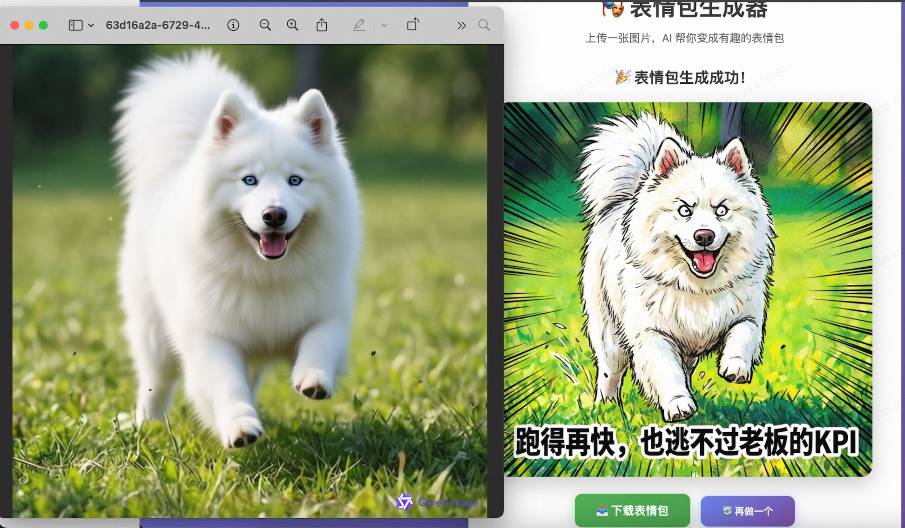

# 🎭 表情包生成器

使用阿里云百炼 `qwen-image-edit` 模型，将普通图片转化为有趣的表情包。

## 📸 效果展示



> 上图：使用本应用将普通图片转化为生动有趣的表情包

---

## 📦 快速开始

### 前置环境：安装 Node.js

本项目需要 **Node.js 16+** 和 **npm** 运行。如果尚未安装，请按以下步骤操作：

#### macOS / Linux

**方式一：使用官方安装包（推荐）**
1. 访问 [Node.js 官网](https://nodejs.org/)
2. 下载 **LTS 版本**（长期支持版）
3. 运行安装程序，按提示完成安装

**方式二：使用 Homebrew（macOS）**
```bash
brew install node
```

**方式三：使用 nvm（版本管理工具，推荐开发者使用）**
```bash
# 安装 nvm
curl -o- https://raw.githubusercontent.com/nvm-sh/nvm/v0.39.0/install.sh | bash

# 安装最新 LTS 版本
nvm install --lts

# 设为默认版本
nvm alias default lts/*
```

**方式四：使用 apt（Ubuntu/Debian）**
```bash
# 安装 NodeSource 仓库（Node.js 18.x）
curl -fsSL https://deb.nodesource.com/setup_18.x | sudo -E bash -
sudo apt-get install -y nodejs
```

#### Windows

**方式一：使用官方安装包（推荐）**
1. 访问 [Node.js 官网](https://nodejs.org/)
2. 下载 **LTS 版本**（Windows 安装程序）
3. 运行 `.msi` 安装程序，按提示完成安装

**方式二：使用 Winget（Windows 11）**
```powershell
winget install OpenJS.NodeJS.LTS
```

**方式三：使用 Chocolatey**
```cmd
choco install nodejs-lts
```

#### 验证安装

安装完成后，在终端/命令提示符中运行：

```bash
node --version
npm --version
```

如果显示版本号（如 `v18.x.x` 和 `9.x.x`），说明安装成功。

---

### 1. 安装项目依赖

**方式一：使用一键安装脚本（推荐）**

**macOS / Linux:**
```bash
chmod +x setup.sh
bash ./setup.sh
```

**Windows:**
双击运行 `setup.bat` 或在命令行执行：
```cmd
setup.bat
```

**方式二：手动安装**
```bash
npm install
```

如果安装失败，可尝试：
- 使用淘宝镜像：`npm config set registry https://registry.npmmirror.com`
- 清除缓存后重试：`npm cache clean --force && npm install`

### 2. 配置 API Key

**获取 API Key：**
1. 访问 [阿里云百炼控制台](https://bailian.console.aliyun.com/)
2. 登录并创建/获取 API Key

**设置环境变量：**

**macOS/Linux:**
```bash
export DASHSCOPE_API_KEY=your_api_key_here
```

**Windows (PowerShell):**
```powershell
$env:DASHSCOPE_API_KEY="your_api_key_here"
```

**Windows (CMD):**
```cmd
set DASHSCOPE_API_KEY=your_api_key_here
```

> 💡 **提示**：以上命令仅在当前终端会话有效。如需永久生效：
> - **macOS/Linux**: 将 `export` 命令添加到 `~/.bashrc`、`~/.zshrc` 或 `~/.bash_profile`
> - **Windows**: 在系统属性 → 环境变量中添加用户变量

### 3. 启动服务

```bash
npm start
```

### 4. 访问应用

打开浏览器访问：http://localhost:3000

---

## 🚀 功能特性

- ✅ 支持图片拖拽上传
- ✅ 可选风格提示词（如：赛博朋克、水墨画、像素风等）
- ✅ 动态轮换的加载文案，缓解等待焦虑
- ✅ 友好的错误处理和重试机制
- ✅ 生成结果可直接下载

---

## 📁 项目结构

```
ai_chuangke/
├── server.js           # 后端服务入口
├── public/
│   ├── index.html      # 前端页面
│   └── demo.png        # 效果展示图
├── package.json        # 项目配置
├── setup.sh            # macOS/Linux 一键安装脚本
├── setup.bat           # Windows 一键安装脚本
└── README.md           # 说明文档
```

---

## 🔧 技术栈

**后端：**
- Node.js
- Express - Web 框架
- Formidable - 文件上传处理
- Axios - HTTP 请求

**前端：**
- 原生 HTML/CSS/JavaScript
- 无需构建工具，开箱即用

**AI 模型：**
- 阿里云百炼 `qwen-image-2.0-pro`

---

## ⚙️ 配置说明

### API 调用参数

在 `server.js` 中可以调整以下参数：

```javascript
parameters: {
  n: 1,                    // 生成图片数量
  negative_prompt: ' ',    // 负面提示词
  prompt_extend: true,     // 自动优化提示词
  watermark: false,        // 是否添加水印
  size: '1024*1024'        // 输出图片尺寸
}
```

### 超时设置

默认超时时间为 120 秒，可根据需要调整：

```javascript
timeout: 120000 // 单位：毫秒
```

---

## 🎨 使用示例

1. **默认风格**：上传图片，不输入风格提示词，AI 自动生成幽默表情包
2. **自定义风格**：
   - 上传人物照片 → 输入"像素风" → 生成像素风格表情包
   - 上传风景照 → 输入"赛博朋克" → 生成科幻风格表情包
   - 上传宠物照 → 输入"卡通风格" → 生成可爱卡通表情包

---

## ❗ 常见问题

### 环境相关

**Q: 没有 Node.js 环境怎么办？**
A: 请参考本文档「前置环境：安装 Node.js」章节，根据您的操作系统选择合适的安装方式。

**Q: `npm install` 安装依赖失败？**
A: 尝试以下方法：
1. 使用淘宝镜像加速：
   ```bash
   npm config set registry https://registry.npmmirror.com
   npm install
   ```
2. 清除 npm 缓存后重试：
   ```bash
   npm cache clean --force
   npm install
   ```
3. 删除 `node_modules` 和 `package-lock.json` 后重新安装：
   ```bash
   rm -rf node_modules package-lock.json
   npm install
   ```

**Q: 提示 `command not found: npm` 或 `'npm' 不是内部或外部命令`？**
A: 说明 Node.js 未正确安装或未添加到系统 PATH。请重新安装 Node.js，并确保勾选「Add to PATH」选项。

### 运行相关

**Q: 提示"API Key 未配置"？**
A: 请确保已正确设置 `DASHSCOPE_API_KEY` 环境变量，并重启终端。

**Q: 请求超时？**
A: 图像生成需要 30-60 秒，请耐心等待。如频繁超时，可在 `server.js` 中增加 `timeout` 值。

**Q: 生成失败？**
A: 检查网络连接，确认 API Key 有效，并确保图片格式正确（JPG/PNG/WEBP）。

---

## 📝 注意事项

- 图片大小建议不超过 5MB
- 支持格式：JPG、PNG、WEBP
- 首次使用可能需要更长的推理时间
- 请确保有足够的 API 调用额度

---

## 📄 License

MIT
